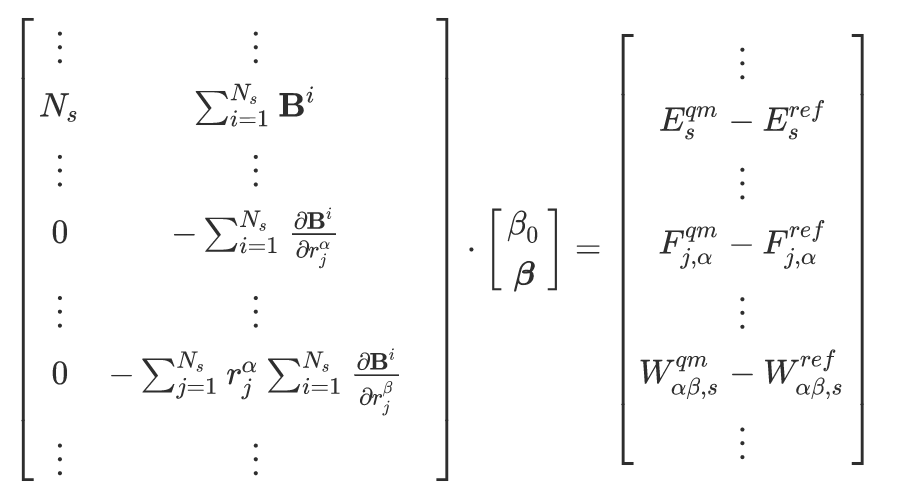

Linear Models
=============

FitSNAP can perform linear regression to obtain models of the form

.. math::

    E_s = \sum_i^{N_s}{  \boldsymbol{\beta}_i \cdot \boldsymbol{B}_i  }

where 

- :math:`s` indexes a particular configuration of atoms

- :math:`E_s` is the potential energy of configuration :math:`s`

- :math:`i` indexes a particular atom

- :math:`N_s` is the number of atoms in configuration :math:`s`

- :math:`\boldsymbol{\beta}_i` is a vector of fitting coefficients for atom :math:`i`

- :math:`\boldsymbol{B}_i` is a vector of atomic environment descriptors for atom :math:`i`

The settings for SNAP descriptors are explained in the `[BISPECTRUM] section <Run.html#bispectrum>`__.

For this linear regression problem we solve the following matrix problem as explained in `Thompson et. al. <snappaper_>`_

  
.. _snappaper: https://www.sciencedirect.com/science/article/pii/S0021999114008353

where 

- :math:`\frac{\boldsymbol{B}_i}{r_j^{\alpha}}` is the gradient of descriptor :math:`\boldsymbol{B}_i` 
  with respect to :math:`r_j^{\alpha}`, the :math:`\alpha` Cartesian direction of atom :math:`j`.

- :math:`E^{qm}_s` is the quantum mechanical target energy for configuration :math:`s`

- :math:`E^{ref}_s` is the reference energy of a potential that is overlayed on the linear regression 
  model, as declared in the `[REFERENCE] section <Run.html#reference>`__

- :math:`F^{qm}_{j,\alpha}` is the quantum mechanical target force for atom :math:`j` in the 
  :math:`\alpha` direction.

- :math:`F^{qm}_{j,\alpha}` is the reference force for atom :math:`j` in the :math:`\alpha` 
  direction, from a potential that is overlayed on the linear regression model, as declared in 
  the `[REFERENCE] section <Run.html#reference>`__.

- :math:`W_{\alpha \beta, s}` is virial in the :math:`\alpha` and :math:`\beta` directions for 
  configuration :math:`s`, where both quantum mechanical target and reference virials are included 
  on the right-hand side of the matrix equation. 

FitSNAP solves this matrix problem using SVD and supports other solvers as well. For more details on 
settings used for descriptors and solvers, please see the docs on 
`FitSNAP Input Scripts <Run.html#input-scripts>`__.

Outputs
-------

The outputs for linear models are explained here. For nonlinear models, please see the
`PyTorch models output section <Pytorch.html#outputs-and-error-calculation>`__. After running a 
linear model fit, the following outputs will be produced:

- :code:`FitSNAP.df` is a Pandas dataframe with rows corresponding to the linear fitting matrix as 
  shown above. We have interactive examples of examining this dataframe and calculating detailed 
  errors from it in our `Colab Python notebook tutorial <tutorialnotebook_>`_.

- :code:`*_metrics.md` is a markdown file containing mean absolute errors and RMSEs for your dataset. 
  If using LAMMPS metal units, energy errors are in eV, and force errors are in eV/Angstrom. The prefix name 
  of this file depends on the :code:`metrics` parameter declared in the `[OUTFILE] section <Run.html#outfile>`__.

- **LAMMPS-ready potential files**. For example if fitting with SNAP descriptors, this will create 
  :code:`*_pot.snapparam` and :code:`*_pot.snapcoeff` files with prefix names depending on the :code:`potential`
  parameter declared in the `[OUTFILE] section <Run.html#outfile>`__. To use these files with LAMMPS, 
  please refer to the LAMMPS documentation. 

Uncertainty Quantification (UQ)
-------------------------------

Linear models have uncertainty quantification (UQ) capabilitiies in the form of extra solvers, which 
are explain here. UQ solvers output a :code:`covariance.npy` file in addition to performing a fit. 

We incorporate an analytical Bayesian UQ solver denoted by :code:`solver = ANL` in the input script. This 
is declared like:

.. code-block:: console

    solver = ANL
    nsam = 133            #this is the number of sample fits requested to be drawn from the distribution
    cov_nugget = 1.e-10   #this is the small number to be added to the matrix inverse for better conditioning 

In development UQ solvers
-------------------------

In general we recommend the use of the :code:`ANL` solver. The following UQ solvers, however, are 
experimental and in development.

OPT
^^^

.. code-block:: console

    solver = OPT

The standard least-squares fit, but solving the optimization problem instead of SVD or matrix 
inversions. Can be useful when matrices are ill-conditioned, or when we add regularization.

MCMC
^^^^

.. code-block:: console

    solver = MCMC
    nsam = 133            #this is the number of sample fits requested to be drawn from the distribution
    mcmc_num = 1000       #this is the number of total MCMC steps requested
    mcmc_gamma = 0.01     #this is the MCMC proposal jump size (smaller gamma increases the acceptance rate)

MCMC sampling, currently assuming constant noise size, but unlike the ANL case, there is flexibility 
if one plays with the log-post function.

MERR
^^^^

.. code-block:: console

    solver = MERR
    nsam = 133                #this is the number of sample fits requested to be drawn from the distribution
    merr_method = iid         #specific liklihood model: options are iid, independent identically distributed, and abc, approximate bayesian computation, and full (too heavy and degenerate, not intended to be used yet)
    merr_mult = 0             #0 is additive model error, 1 is multiplicative
    merr_cfs = 5 44 3 49 10 33 4 39 38 23       #can provide either a list of coefficient indices to embed on, or "all"
    cov_nugget = 1.e-10       #this is the small number to be added to the matrix inverse for better conditioning

Model error embedding approach - powerful but very slow. Requires an optimization that does not run 
in parallel currently, and is not guaranteed to converge.

BCS
^^^

.. code-block:: console

    solver = BCS

Fitting with Bayesian compressive sensing, need to learn how to prune bispectrum bases in order for 
this to be useful. Not working properly yet.

.. _tutorialnotebook: https://colab.research.google.com/github/FitSNAP/FitSNAP/blob/master/tutorial.ipynb
